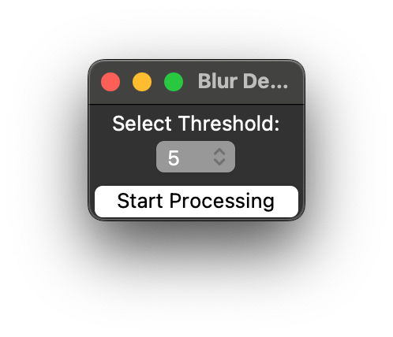

# Blur Detection with GUI Folder select, Tresjold Select and HEIC prosessing
Blur Detection works using the total variance of the laplacian of an
image, this provides a quick and accurate method for scoring how blurry
an image is.

This Python script provides a user-friendly GUI (Graphical User Interface) for detecting blurry images in a selected folder. It leverages the power of the OpenCV library for image processing and offers several features to make the image blur detection process more convenient and efficient.

# Image Blur Detection Tool with GUI

## Features

- **GUI Interface:** The tool offers a graphical interface for selecting a folder containing images and setting the blur detection threshold.
- **Threshold Selection:** Users can choose from a range of predefined threshold values, making it easy to adjust sensitivity to blur detection.
- **Support for Various Image Types:** The tool supports a wide range of image file types, including JPG, PNG, JPEG, and HEIC.
- **HEIC to JPEG Conversion:** When processing HEIC (High-Efficiency Image Format) images, the tool automatically converts them to JPEG format for analysis.
- **Log Generation:** The tool creates a log file (`log.txt`) in the subfolder, providing detailed information about the processed images and their blur scores.
- **Results Export:** The script saves the results in a JSON file (`blurry_results.json`) containing the folder path, chosen threshold, and a list of processed images with their scores.
- **Visual Feedback:** For users who prefer visual feedback, the tool displays the input image and a visualization of the blur map.
- **Efficient Processing:** The script only moves images below the selected blur threshold, preserving sharp images.

## Why Use the GUI Version?

Compared to the terminal interface version of the Image Blur Detection Tool, the GUI version offers several advantages:

1. **User-Friendly:** The GUI provides an intuitive interface that makes it easy for users of all levels of technical expertise to use the tool.

2. **Threshold Selection:** Users can easily choose from a list of predefined threshold values, simplifying the process of adjusting the sensitivity for blur detection.

3. **HEIC Support:** This version supports HEIC images and automatically converts them to JPEG for processing, eliminating the need for manual conversion.

4. **Visual Feedback:** Users can view the images being processed in the terminal wit the score

5. **Log Generation:** The tool creates a log file for keeping records of processed images and their blur scores.

6. **Subfolders:** Images are moved to a subfolder when it´s below the treshold

## Dependencies

To run this tool, you'll need the following dependencies:

- Python (>=3.6)
- OpenCV (`pip install opencv-python`)
- Pillow (`pip install pillow`)
- numpy (`pip install numpy`)
- tkinter (usually included with Python)

## M1 Mac

```bash
brew install libffi libheif
pip install git+https://github.com/carsales/pyheif.git


```
## Contributon


The saved json file has information on how blurry an image is, the higher the value, the less blurry the image.

```json

This is based upon the blogpost [Blur Detection With Opencv](https://www.pyimagesearch.com/2015/09/07/blur-detection-with-opencv/) by Adrian Rosebrock.


